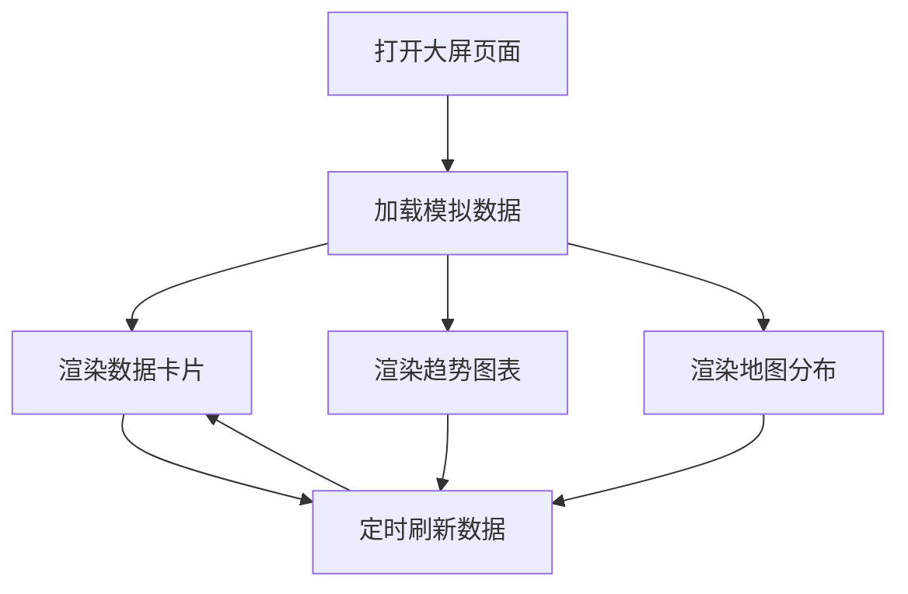

# 智慧可视化大屏 - 产品需求文档

## 1. 产品概述

智慧可视化大屏是一款面向智慧城市/智慧园区场景的数据展示平台，通过金色奢华的视觉风格呈现关键指标的实时状态与历史趋势，为决策者提供直观、高效的数据洞察。

- 展示园区/城市核心运营数据，包括安防、能耗、环境、人员等关键维度
- 目标用户：园区管理者、城市运营中心管理人员
- 产品价值：数据一目了然，提升管理效率与决策质量

## 2. 核心功能

### 2.1 功能模块

1. **首页大屏**：智慧园区总览，包含多个数据卡片、图表、地图分布
2. **数据卡片模块**：展示关键KPI指标（访客数、设备在线率、能耗数据等）
3. **实时监控模块**：展示设备状态、告警信息
4. **趋势图表模块**：折线图、柱状图展示数据变化趋势
5. **地图分布模块**：展示设备/区域的地理位置分布

## 3. 核心流程

用户打开大屏页面 → 自动加载模拟数据 → 实时展示数据卡片/图表/地图 → 每隔固定时间刷新数据

## 4. 用户界面设计

### 4.1 设计风格

- **主色调**：深色背景 (#0a0a0f) + 金色强调 (#d4af37, #f5d78e)
- **辅助色**：深灰 (#1a1a2e)、暖白 (#f5f5f5)
- **字体**：Playfair Display (标题) + Source Sans Pro (正文)
- **布局风格**：卡片式布局，左中右分栏，数据层层递进
- **图标风格**：线性图标，金色描边
- **动效**：淡入动画、数字滚动、图表渐显

### 4.2 页面设计概览

| 页面 | 模块 | UI元素 |
|------|------|--------|
| 大屏首页 | 顶部标题栏 | 居中标题，时间日期，金色边框 |
| 大屏首页 | 左侧数据卡片 | 4个指标卡片：访客统计、能耗数据、设备状态、环境监测 |
| 大屏首页 | 中间主图表 | 24小时访客趋势折线图 |
| 大屏首页 | 右则数据面板 | 设备在线率环形图、实时告警列表 |
| 大屏首页 | 底部地图 | 园区区域分布热力图 |

### 4.3 响应式策略

- 桌面端优先 (1920x1080 及以上)
- 自动适应不同屏幕尺寸
- 支持全屏展示模式

### 4.4 视觉细节

- 卡片带有微妙的金色光晕边框
- 深色背景带有细微的网格纹理
- 图表使用金色渐变填充
- 数字使用等宽字体，带数字滚动动画
