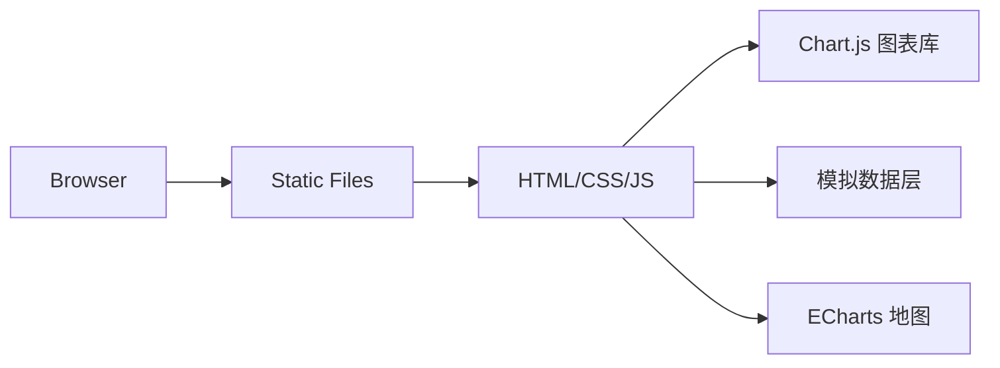

# 智慧可视化大屏 - 技术架构文档

## 1. 架构设计



**架构说明**：
- 前端单页应用，纯静态文件部署
- 使用 Chart.js 实现折线图、柱状图、环形图
- 使用 ECharts 实现地图热力分布
- 模拟数据层定时更新，模拟真实数据刷新

## 2. 技术选型

- **前端框架**：原生 HTML5 + CSS3 + JavaScript
- **图表库**：Chart.js@4 (曲线图/柱状图/环形图)
- **地图库**：ECharts@5 (地图热力图)
- **样式预处理**：原生 CSS Variables
- **构建工具**：无需构建，直接打开 index.html
- **后端**：无 (使用模拟数据)

## 3. 路由定义

| 路由 | 用途 |
|------|------|
| / | 大屏首页，展示所有数据模块 |

## 4. 页面结构

```
index.html
├── CSS (内嵌)
│   ├── 全局样式 (变量定义、重置样式)
│   ├── 布局样式 (网格布局、响应式)
│   ├── 组件样式 (卡片、图表容器)
│   └── 动画样式 (淡入、数字滚动)
├── HTML
│   ├── 顶部标题栏
│   ├── 左侧数据卡片区 (4个卡片)
│   ├── 中间趋势图表区
│   ├── 右侧数据面板 (环形图+告警列表)
│   └── 底部地图区
└── JavaScript (内嵌)
    ├── 模拟数据生成器
    ├── 图表初始化
    ├── 定时刷新逻辑
    └── 数字滚动动画
```

## 5. 数据结构

### 5.1 模拟数据类型

```javascript
// 访客统计数据
visitorData: { today: number, yesterday: number, trend: number[] }

// 能耗数据
energyData: { consumption: number, unit: string, change: number }

// 设备状态
deviceData: { online: number, total: number, list: Array<{name, status}> }

// 环境监测
envData: { temperature: number, humidity: number, aqi: number }

// 告警信息
alerts: Array<{ time: string, message: string, level: string }>
```

## 6. 性能指标

- 首屏加载时间 < 2秒
- 图表渲染帧率 60fps
- 数据刷新间隔 5秒
- 支持 1920x1080 及以上分辨率
